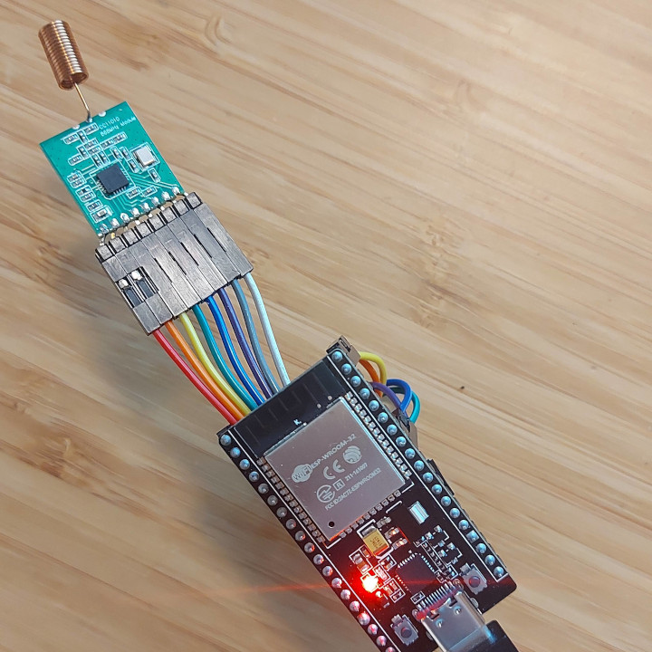
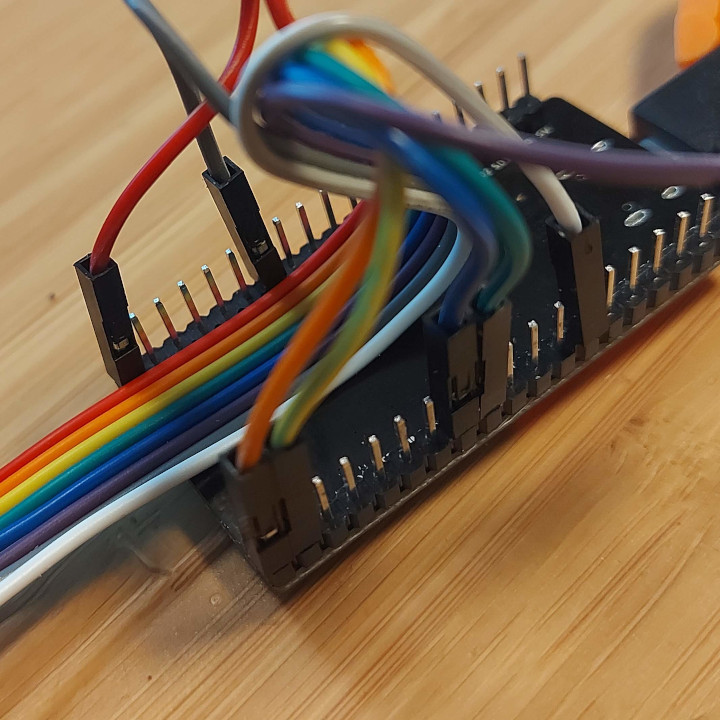

# ESP832 Wreless MBus for Multical21 water meter.

## Features
Configuration for Home Assistan with MQTT
Support for AES-12 decryption (with vaild key)


## Parts 
Use these arfilliate links to support me!
[CC1101 Module] (https://s.click.aliexpress.com/e/_DembjFr)
[ESP32 DevKit] (https://s.click.aliexpress.com/e/_mPgipQY)

## Wireing
CC1101 => ESP32
VCC   => 3V3
GND   => GND
CSN   => P4
MOSI  => P23
MISO  => P19
SCK   => P18
GD0   => P32  
GD2   => not connected 




## Compile
Rename credentials_template.h to credentials.h and add your details.
Complie and upload with [PlatformIO](https://platformio.org/)

## Home Assistant

Setup [MQTT](https://www.home-assistant.io/integrations/mqtt/} if you don't already have it.

Add this to configuration.yaml
```
mqtt:
  sensor:
    - name: "Water Meter Usage"
      state_topic: "watermeter/0/sensor/mydatajson"
      unit_of_measurement: "m³"
      value_template: "{{ value_json.CurrentValue }}"
      device_class: water
      state_class: total_increasing
      availability:
        - topic: "watermeter/0/online"
          payload_available: "True"
          payload_not_available: "False"
    - name: "Water Meter Month Start Value"
      state_topic: "watermeter/0/sensor/mydatajson"
      unit_of_measurement: "m³"
      value_template: "{{ value_json.MonthStartValue }}"
      device_class: water
      state_class: total_increasing
    - name: "Water Meter Room Temperature"
      state_topic: "watermeter/0/sensor/mydatajson"
      value_template: "{{ value_json.RoomTemp }}"
      unit_of_measurement: "°C"
    - name: "Water Meter Water Temperature"
      state_topic: "watermeter/0/sensor/mydatajson"
      value_template: "{{ value_json.WaterTemp }}"
      unit_of_measurement: "°C"
```

This is a fork of [chester4444/esp-multical21](https://github.com/chester4444/esp-multical21).
Thanks to chester4444for his effort.
