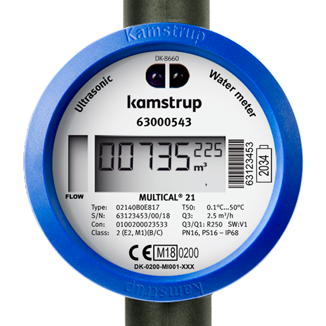

# Kamstrup Multical 21 water meter in Home Assitant (Wireless MBus)



### Features
 * Configuration ready for Home Assistan with MQTT.
 * Support for AES-128 decryption (with vaild key).
 * CRC Check of recived data.
 * Wireless reading of data.
 * Easy to build and configure.


### Parts 
Use these arfilliate links to support me!\
[CC1101 Module](https://s.click.aliexpress.com/e/_DembjFr) \
[ESP32 DevKit](https://s.click.aliexpress.com/e/_mPgipQY) \
Some cables


### Wiring

CC1101 => ESP32\
VCC   => 3V3\
GND   => GND\
CSN   => P4\
MOSI  => P23\
MISO  => P19\
SCK   => P18\
GD0   => P32\
GD2   => not connected


### Build and Upload Firmware
* Make sure you have a decryption key for your meter (you need to ask your water service provider for it).
* Read the serial number on the meter (typically S/N: XXXXXXXX/A/20, the serial number is the XXXXXXXXX part).
* Rename credentials_template.h to credentials.h and add your details.
* Compile and upload:
  - You need [VS Code](https://code.visualstudio.com/) and the [PIO Plugin](https://platformio.org/)
  - Open the project folder with the platformio.ini file (File -> Open Folder...), connect the ESP32 via USB then build and upload with Ctrl+Alt+U.

### Home Assistant

Setup [MQTT](https://www.home-assistant.io/integrations/mqtt/) if you don't already have it.

Add this to configuration.yaml
```
mqtt:
  sensor:
    - name: "Water Meter Usage"
      state_topic: "watermeter/0/sensor/mydatajson"
      unit_of_measurement: "m³"
      value_template: "{{ value_json.CurrentValue }}"
      device_class: water
      state_class: total_increasing
      availability:
        - topic: "watermeter/0/online"
          payload_available: "True"
          payload_not_available: "False"
    - name: "Water Meter Month Start Value"
      state_topic: "watermeter/0/sensor/mydatajson"
      unit_of_measurement: "m³"
      value_template: "{{ value_json.MonthStartValue }}"
      device_class: water
      state_class: total_increasing
    - name: "Water Meter Room Temperature"
      state_topic: "watermeter/0/sensor/mydatajson"
      value_template: "{{ value_json.RoomTemp }}"
      unit_of_measurement: "°C"
    - name: "Water Meter Water Temperature"
      state_topic: "watermeter/0/sensor/mydatajson"
      value_template: "{{ value_json.WaterTemp }}"
      unit_of_measurement: "°C"
```

This is a based on [chester4444/esp-multical21](https://github.com/chester4444/esp-multical21).
Thanks to chester4444for his effort.
